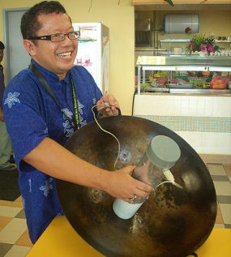

Jika kita berbicara tentang perkembangan dunia Teknologi Informasi (TI) dan internet di Indonesia, rasanya mustahil untuk tidak menyebut nama Prof. Dr. Eng. Ir. Onno Widodo Purbo, M.Eng., Ph.D. Sosok pria kelahiran Bandung, 17 Agustus 1962 ini dikenal luas sebagai "Bapak Internet Indonesia" sekaligus pejuang tangguh gerakan *Open Source* di Tanah Air. Di balik penampilannya yang ceplas-ceplos dan sangat sederhana kerap hanya mengenakan kaos, celana pendek, dan hobi bepergian dengan sepeda tersimpan visi besar yang telah mendobrak batasan akses informasi bagi jutaan rakyat Indonesia.

Artikel ini akan mengupas tuntas perjalanan hidup, pemikiran, kiprah, serta deretan karya Onno W. Purbo yang menjadikannya salah satu tokoh teknologi paling dihormati, tidak hanya di Indonesia, tetapi juga di mata dunia.

## Titik Awal: Ketertarikan pada Lampu Kelap-Kelip dan Pesawat Terbang

Lahir dari pasangan Prof. Ir. Hasan Poerbo, seorang guru besar arsitektur dan lingkungan hidup di Institut Teknologi Bandung (ITB), dan Partini, Onno tumbuh di lingkungan yang kental dengan nilai-nilai intelektual dan keberpihakan pada rakyat kecil. Ketertarikannya pada dunia teknik sudah terlihat sejak ia duduk di bangku kelas 3 SMP. Saat itu, ia membuat sebuah prakarya lampu *flip-flop* (lampu yang menyala kelap-kelip secara bergantian) dan menghabiskan semalaman penuh hanya untuk menatap dan memikirkan bagaimana lampu tersebut bisa bekerja sedemikian rupa.

Memasuki masa SMA, minat Onno semakin bercabang. Terinspirasi dari ayahnya yang pernah berkarier di TNI dan tren B.J. Habibie pada masa itu, Onno sempat mendalami *aeromodeling* dengan membuat pesawat layang (*glider*) sepanjang 1,5 meter hasil rancangannya sendiri. Namun, pada saat yang bersamaan, ia juga keranjingan mendengarkan siaran radio gelombang pendek (SW) dan belajar membuat pemancar radio sendiri dari tabung-tabung bekas.

Berkat dorongan sang ayah yang melihat masa depan cerah di bidang elektronika, Onno akhirnya memilih masuk ke jurusan Teknik Elektro ITB pada tahun 1981. Di kampus inilah, Onno semakin aktif dalam Organisasi Amatir Radio Indonesia (ORARI) dan mulai bereksperimen menghubungkan komputer dengan pemancar radio, sebuah cikal bakal dari teknologi internet tanpa kabel yang kelak ia kembangkan. Ia lulus sebagai wisudawan terbaik pada tahun 1987.

## Membangun Jaringan Internet dari Jarak Jauh

Setelah lulus dari ITB, Onno mendapatkan beasiswa untuk melanjutkan studi S2 di McMaster University, Kanada, di bidang Semikonduktor Laser (lulus 1989), dan kemudian S3 di Universitas Waterloo, Kanada, di bidang Teknologi Rangkaian Terintegrasi untuk Satelit (lulus 1993).

Tinggal di luar negeri memunculkan satu masalah klasik: mahalnya biaya komunikasi ke Indonesia. Tidak kehabisan akal, Onno menggunakan jaringan Bitnet di kampus-kampus Amerika Utara dan mengombinasikannya dengan frekuensi radio amatir. Dengan meminta izin kepada pemerintah Kanada untuk memancar menggunakan lisensi amatir radionya, Onno berhasil mengirimkan data suara yang diubah menjadi teks (melalui *soundcard* komputer) melintasi samudra hingga diterima oleh rekan-rekannya sesama anggota ORARI di Indonesia. Ini adalah salah satu bentuk koneksi internet paling awal di Indonesia, yang membuktikan bahwa jaringan informasi tidak melulu harus bergantung pada kabel telepon yang sangat mahal.

## RT/RW-Net, Wajanbolic, dan Pertempuran Melawan Regulasi

Kembali ke Indonesia, Onno mengajar sebagai dosen di ITB dan memelopori koneksi internet pertama di kampus tersebut. Namun, ia menyadari bahwa tarif internet *dial-up* melalui kabel telepon (seperti yang disediakan Telkom saat itu) sangatlah tidak masuk akal bagi rakyat biasa. Biaya pulsa telepon yang menyala 24 jam bisa mencapai jutaan rupiah per bulan dengan kecepatan yang sangat lambat.

Untuk memecahkan masalah ini, Onno menginisiasi teknologi RT/RW-Net, yakni sebuah jaringan komputer swadaya masyarakat yang mendistribusikan koneksi internet murah di tingkat rukun tetangga. Untuk menangkap sinyal nirkabel (Wi-Fi), Onno mempopulerkan penemuan luar biasa yang sangat merakyat: **Wajanbolic**. Ini adalah antena penguat sinyal Wi-Fi frekuensi 2,4 GHz yang dirakit secara murah meriah menggunakan wajan penggorengan, pipa paralon, aluminium foil, dan USB WLAN adapter.

*Sumber gambar: Detik.net.id.*

Karya-karya ini adalah bentuk perlawanan Onno terhadap "buta internet". Namun, jalan yang ditempuh tidak mulus. Penggunaan frekuensi radio 2,4 GHz pada saat itu dianggap ilegal tanpa izin resmi, sehingga alat-alat jaringan kampus dan masyarakat sering kali disita oleh aparat pemerintah (Kominfo). Alih-alih melawan dengan kekerasan, Onno mengubah strateginya: ia menulis buku dan menyebarkan panduan cara merakit internet murah ke seluruh penjuru negeri. Lewat gerakan "pemberontakan" damai dan desakan tanpa henti, pada tahun 2005 pemerintah akhirnya membebaskan frekuensi 2,4 GHz dari Biaya Hak Penggunaan, sebuah kemenangan besar bagi demokratisasi internet di Indonesia.

## Meninggalkan Menara Gading demi Filosofi "Copyleft"

Salah satu kisah paling monumental dalam hidup Onno terjadi pada Februari 2000. Saat itu, ITB mengadakan seminar mengenai Hak Cipta dan Hak Paten yang diisi oleh para profesor. Mendengar paparan bahwa hasil penelitian harus dipatenkan demi keuntungan finansial dan prestise, nurani Onno memberontak.

Dalam pandangannya, ilmu pengetahuan seharusnya dibagikan secara gratis agar seluruh bangsa bisa merasakan manfaatnya. Mematenkan ilmu hanya akan memperlebar jurang kebodohan di Indonesia. Terusik oleh pemikiran tersebut, Onno tidak bisa tidur selama tiga hari dua malam. Pada hari ketiga, ia mengambil keputusan paling nekat dalam hidupnya: ia menulis surat pengunduran diri sebagai Pegawai Negeri Sipil (PNS) dan dosen ITB. Ia bahkan mengembalikan gaji terakhirnya kepada rektorat.

Onno memilih jalan hidup berdasarkan prinsip **"Copyleft"** (sumber terbuka/ *Open Source*), kebalikan dari *Copyright*. Ia meyakini bahwa Tuhan yang memiliki segala ilmu saja tidak pernah mematenkan ilmu-Nya, lalu mengapa manusia harus membatasinya?. Ia sering mengutip pesan dari mantan dosennya di ITB, Pak Soegiardjo Soegidjoko: *"Kalkulator yang di ATAS tidak pernah salah hitung"*. Kepercayaan bahwa rezeki tidak akan tertukar inilah yang membuatnya tak gentar hidup tanpa gaji tetap selama belasan tahun usai keluar dari ITB.

## Kiprah Bapak Open Source Indonesia dan Karya-karyanya

Setelah keluar dari jalur akademis formal, kiprah Onno W. Purbo di dunia *Open Source Software* (OSS) dan teknologi informasi semakin menggila. Berikut adalah berbagai sumbangsih nyatanya:

- **Membuat Distro Linux Mandiri**: Onno terlibat dalam pembuatan berbagai distribusi (distro) Linux lokal yang disesuaikan untuk kebutuhan masyarakat, seperti Distro SchoolOnffLine, SMEOnffLine, ORARINux, dan SekolahNux.
- **Penulis Buku Produktif**: Onno telah menulis lebih dari 50 judul buku. Karyanya mencakup panduan TCP/IP, keamanan jaringan, teknik RT/RW-Net, hingga pembuatan jaringan seluler 5G sendiri. Hebatnya, ia juga merilis buku-buku pelajaran Teknologi Informasi dan Komunikasi (TIK) untuk SMA/MA yang materinya sepenuhnya berbasis *Open Source Software* (seperti Linux dan OpenOffice), yang didistribusikan secara gratis sebagai Buku Sekolah Elektronik (BSE) oleh pemerintah.
- **VoIP Rakyat & OpenBTS**: Selain internet, Onno juga merintis "VoIP Rakyat", sentral telepon gratis berbasis protokol internet (SIP) agar masyarakat bisa bertelepon tanpa biaya pulsa konvensional. Ia juga giat menyebarkan teknologi OpenBTS, sebuah *Base Transceiver Station* mini berbasis *open source* yang memungkinkan masyarakat di daerah terpencil membangun jaringan seluler GSM sendiri.
- **E-Learning dan Open Course**: Hasrat Onno untuk mencerdaskan orang banyak (bukan hanya satu atau dua kelas) diwujudkan dengan membangun *E-Learning Rakyat*. Di platform ini, puluhan ribu siswa bisa belajar gratis. Saat ini, sebagai Rektor Institut Teknologi Tangerang Selatan (ITTS), ia memelopori sistem kuliah IT gratis yang bisa diakses siapa saja melalui `opencourse.itts.ac.id`, dengan memberikan e-sertifikat bagi mereka yang mendapatkan nilai di atas 90.
- **Advokasi Keamanan Siber**: Onno kerap menjadi narasumber penting terkait keamanan data. Ia mengedukasi masyarakat dan pemerintah mengenai mitigasi kebocoran data, audit *Data Privacy* sesuai UU PDP, dan pemanfaatan sistem keamanan berbasis *Open Source* yang efisien.

## Pengakuan Dunia: Jonathan B. Postel Service Award

Perjuangan Onno W. Purbo yang konsisten memberdayakan masyarakat melalui internet murah mengundang decak kagum dunia internasional. Ia sering diundang menjadi pembicara kunci dalam forum-forum global, seperti *World Summit on the Information Society* (WSIS) di Swiss dan *Internet Engineering Task Force* (IETF), karena rekam jejak Indonesia yang secara swadaya membangun lebih dari 60.000 titik RT/RW-Net yang digerakkan oleh rakyat biasa.

Puncaknya, pada 11 November 2020, Internet Society (ISOC) memberikan penghargaan prestisius **Jonathan B. Postel Service Award** kepada Onno. Penghargaan yang setara dengan "Hadiah Nobel" di dunia internet ini diberikan khusus untuk para inovator visioner yang berdedikasi memperluas akses internet di seluruh dunia. Onno terpilih karena peran kuncinya dalam demokratisasi akses internet dan kepeloporannya memanfaatkan teknologi berbiaya rendah di pedesaan.

## Penutup: Menjadi Manusia yang Bermanfaat

Ketika banyak orang mendesak agar dirinya diangkat menjadi Menteri Komunikasi dan Informatika, Onno selalu menjawab dengan halus dan jenaka. Baginya, jabatan menteri yang hanya berumur lima tahun bukanlah sebuah tolok ukur kesuksesan.

Tujuan hidup Onno W. Purbo sangatlah sederhana dan filosofis: ia ingin menjadi manusia yang bermanfaat bagi orang lain. Menurut kutipannya yang diambil dari hadist Rasulullah SAWW, *"Sebaik-baik manusia adalah yang bermanfaat bagi manusia lainnya"* kutipan itu yang menjadi prinsip bagi Prof Onno. Melalui buku-buku yang digratiskannya, video-video *tutorial* di YouTube, ribuan artikel, dan jaringan-jaringan komunitas *Open Source* yang ia rintis, Onno telah menunaikan tujuannya. Ia membuktikan bahwa kedaulatan digital dan kemajuan sebuah bangsa tidak harus selalu dimotori oleh pemerintah atau konglomerat, melainkan bisa dibangun dari bawahdari tangan-tangan rakyat biasa yang mau belajar dan berbagi.

## Referensi

### Artikel Berita dan Biografi (Web)

- **Biografiku.com**: "Biografi Onno W Purbo" - [https://www.biografiku.com/biografi-onno-w-purbo/](https://www.biografiku.com/biografi-onno-w-purbo/).
- **Wikipedia bahasa Indonesia**: "Onno W. Purbo" - [https://id.wikipedia.org/wiki/Onno_W._Purbo](https://id.wikipedia.org/wiki/Onno_W._Purbo).
- **CNN Indonesia**: "Onno, Wajan, dan Kisah 'Perang' Melawan Buta Internet RI" - [https://www.cnnindonesia.com/teknologi/20221202161533-192-882019/onno-wajan-dan-kisah-perang-melawan-buta-internet-ri](https://www.cnnindonesia.com/teknologi/20221202161533-192-882019/onno-wajan-dan-kisah-perang-melawan-buta-internet-ri).
- **Liputan6.com**: "Onno W. Purbo, Pejuang IT Indonesia yang Hobi Bersepeda" - [http://www.liputan6.com/tekno/read/667563/onno-w-purbo-pejuang-it-indonesia-yang-hobi-bersepeda](http://www.liputan6.com/tekno/read/667563/onno-w-purbo-pejuang-it-indonesia-yang-hobi-bersepeda).
- **detikInet**: "Bangga! Onno W Purbo Dapat Penghargaan Dunia Bidang Internet" - [https://inet.detik.com/cyberlife/d-5260444/bangga-onno-w-purbo-dapat-penghargaan-dunia-bidang-internet](https://inet.detik.com/cyberlife/d-5260444/bangga-onno-w-purbo-dapat-penghargaan-dunia-bidang-internet).
- **Kumparan**: "Onno W. Purbo Raih Penghargaan Internet Dunia Jonathan B. Postel Service Award" - [Tautan Kumparan](https://kumparan.com/kumparantech/response/onno-w-purbo-raih-penghargaan-internet-dunia-jonathan-b-postel-service-award-1uZYLtCUsPq).
- **OnnoWiki**: "Onno W. Purbo" - [http://www.onnocenter.or.id/wiki/index.php/Onno_W._Purbo](http://www.onnocenter.or.id/wiki/index.php/Onno_W._Purbo).
- **eLearning Rakyat**: Portal kursus online gratis yang dibangun oleh Onno W. Purbo - [https://lms.onnocenter.or.id/moodle/](https://lms.onnocenter.or.id/moodle/).
- Dokumen / Buku TIK berbasis *Open Source* yang ditulis Onno W. Purbo, seperti Buku Sekolah Elektronik (BSE) dan pedoman keamanan siber.
- Video "ONNO W PURBO dan SEJARAH INTERNET INDONESIA" & "Sisi Lain ONNO W PURBO: Jadi Rektor ITTS!" di kanal **GIZMOLOGI**.
- Video "Bincang Bareng Onno W. Purbo Seputar Dunia IT di Indonesia" di kanal **Indonesia Belajar**.
- Video "Onno W Purbo Tadinya Berpikir Ikuti Jejak BJ Habibie" di kanal **voidotid**.
